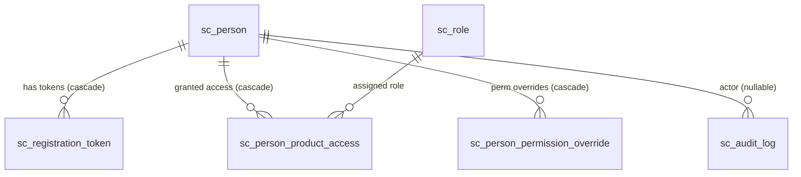
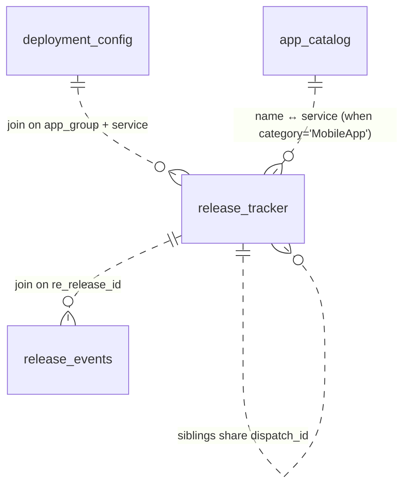
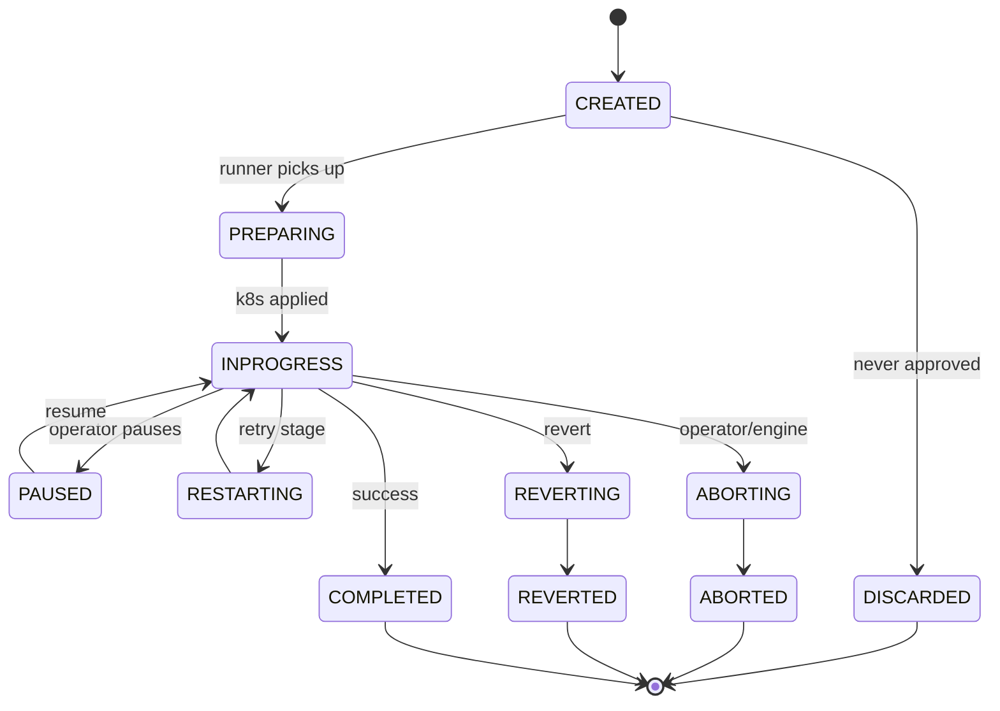
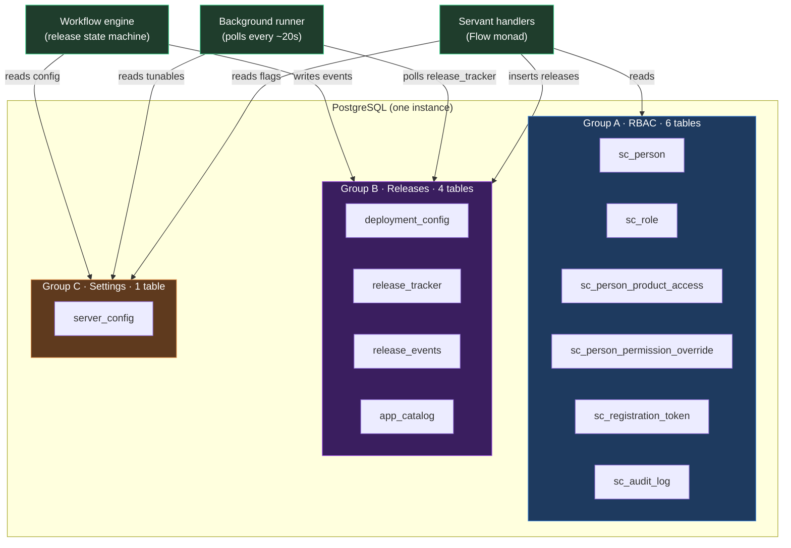

# System Control Centre — Database Guide

> Plain-English tour of the backend database: what's stored, how the Haskell code talks to it, and what happens to which table when the system does something. Aimed at someone new to the backend.

## The 30-second version

- There is **one PostgreSQL database**. Just one. Everything lives in it.
- It has **11 tables**. They split into three groups based on what they're for:
  - **6 RBAC tables** — who is allowed to do what.
  - **4 release tables** — the actual release flows (backend + mobile).
  - **1 config table** — runtime settings (flags/tunables). **Secrets are NOT here** — they're read from the environment (see below).
- The Haskell backend opens **one connection pool** to this DB. Every request reuses connections from that pool.
- Tables are not all wired together with hard foreign keys. Some are; many use **convention-based joins** (e.g. "this column matches that column"). The Haskell code is what keeps things consistent.

If you ever want to look at the raw schema, it's in:

```
backend/dev/sql-seed/system-control-seed.sql           ← all CREATE TABLE statements
backend/dev/migrations/system-control/00*.sql          ← incremental changes
```

---

## 1. How Haskell talks to the database

```
HTTP request
    │
    ▼
Servant handler (e.g. createReleaseH)
    │
    │  runs in `Flow` monad   ─┐
    ▼                          │
withDb $ \db -> runDB db $ ... │  AppState carries the connection pool
    │                          │
    ▼                          │
Beam SQL (Haskell DSL)         │
    │                          │
    ▼                          │
PostgreSQL                    ─┘
```

### The connection pool

One file does the wiring: `backend/src/Core/DB/Connection.hs`.

```haskell
mkDBEnv cfg = newPool $ defaultPoolConfig
    (connectPostgreSQL ...)   -- how to open a connection
    close                     -- how to close one
    30                        -- keep up to 30 idle
    20                        -- max 20 in use at once
```

So:
- Server starts → opens a pool.
- Each request gets a connection from the pool, uses it, returns it.
- If 20 requests want connections at once, the 21st waits.
- No sharding, no read replica, no multi-tenant routing. It's one DB, one pool.

### The `Flow` monad

Every handler runs in `Flow`, which is just a fancy name for "IO with access to AppState". `AppState` carries the connection pool, the config, and the logger.

When you need the DB inside a handler:

```haskell
myHandler :: Flow Response
myHandler = do
    rows <- withDb $ \db -> runDB db $ findSomething
    ...
```

`withDb` grabs a connection. `runDB` runs the Beam query on it.

### Beam — the ORM

Beam is a Haskell library that lets you write SQL using Haskell types. For each table there's a Haskell record like:

```haskell
data ScPersonT f = ScPersonT
    { spId        :: Columnar f UUID
    , spEmail     :: Columnar f Text
    , spFirstName :: Columnar f Text
    ...
    }
```

These records live in:
- `backend/src/Core/Auth/Schema.hs` — RBAC tables
- `backend/src/Products/Autopilot/Types/Storage/Schema.hs` — release tables
- `backend/src/Products/Autopilot/Mobile/Types/Storage.hs` — `app_catalog`

You won't usually write these yourself; you'll mostly use the queries built on top of them.

---

## 2. The three groups of tables

### Group A — RBAC (who can do what)

Lives in `Core/Auth/*`. Six tables.

| Table | What it stores |
|---|---|
| `sc_person` | Users. Email, name, password hash, is-active, is-superadmin. |
| `sc_role` | Named bundles of permissions, scoped per-product (`autopilot`, `config-manager`). E.g. "Admin", "Manager", "Viewer". |
| `sc_person_product_access` | "Person P has role R on product X." |
| `sc_person_permission_override` | Per-user GRANT / DENY overrides on top of role permissions. |
| `sc_registration_token` | Invite tokens for new users (one-shot). |
| `sc_audit_log` | Append-only log of who did what. |

These tables **are** wired with real foreign keys. If you delete a user, their access rows / tokens / overrides delete with them (`ON DELETE CASCADE`).

### Group B — Releases (the actual work)

Lives in `Products/Autopilot/*`. Four tables.

| Table | What it stores |
|---|---|
| `release_tracker` | **One row per release.** Backend rollouts, configmap changes, VS edits, mobile dispatches — all live here, distinguished by the `category` column. |
| `release_events` | Append-only log of everything that happens to a release (status changes, k8s ops, snapshots, decisions). |
| `deployment_config` | Static config per app-group and per-service (cluster, namespace, VirtualService name, rollout strategy, etc.). Releases read from this. |
| `app_catalog` | List of mobile apps releasable through SCC. Was added with mobile support. |

These tables have **no foreign keys at the DB level**. Joins are by column convention (more on this below). The Haskell code enforces consistency.

### Group C — Settings (one shared table)

| Table | What it stores |
|---|---|
| `server_config` | Runtime feature flags + tunables. Scoped per-product via the `product` column. |

This table is touched by many places, so it doesn't sit inside either of the two Beam records above. It has its own helper file: `backend/src/Shared/Queries/ServerConfig.hs`.

**Secrets do NOT live in `server_config`.** Mobile credentials (GitHub App key, Play
service-account JSON, App Store Connect `.p8` + ids) are read from the process
**environment** (`SC_GITHUB_APP_*` / `SC_PLAY_SA_JSON_B64` / `SC_ASC_*`) by
`Core.Secrets` — injected from a k8s Secret in prod, sourced from
`backend/dev/local-mobile-secrets.env` in dev. They were moved out of the DB so
they're never returned by `GET /server-config` or exposed in the frontend.

### Group D — AI (changelog summaries)

| Table | What it stores |
|---|---|
| `release_summary` | The release-changelog AI summary, content-keyed. Doubles as the one-generator lock: `status` (`pending`/`ready`/`failed`), `summary_long`/`summary_short`, `model`, `commit_count`. Unique on `content_key`. |
| `ai_summary_cache` | Generic content-addressed AI summary cache (`subject_type/subject_id/task/model/prompt_hash` → summary + tokens + TTL). |
| `ai_audit_log` | One row per AI call (hit / ok / error) — model, prompt hash, token counts, latency, status, error, `created_by`. |

Migrations `0023-ai-tables.sql` + `0024-release-summary.sql`. The engine is in
`backend/src/Shared/AI/*`; the AI config (base URL, model, temperature, cache TTL)
lives in `server_config` (product `autopilot`), the API key in the `SC_AI_API_KEY`
env secret. **Full design + the Grid/LiteLLM integration details are in
[`docs/ai-integration.md`](./ai-integration.md) (§5 schema, §13 the changelog feature).**

---

## 3. How tables relate to each other

### RBAC group — hard foreign keys



To answer "what can user U do on product P?", the backend reads three tables:
1. `sc_person_product_access` — find U's role on P.
2. `sc_role` — read the base permissions for that role.
3. `sc_person_permission_override` — apply GRANT / DENY overrides on top.

This logic lives in `Core/Auth/Queries.hs`.

### Releases group — no foreign keys, joined by convention



What each dotted line means:

- **`release_tracker` → `deployment_config`** by `app_group` + `service`. To know "what cluster and namespace does this release deploy to?", the workflow looks up the matching `deployment_config` row.
- **`release_tracker` → `release_events`** by `re_release_id`. Every state change writes an event row. The detail page reads these to show the timeline.
- **`release_tracker` → `app_catalog`** for mobile rows only. The release's `service` column holds the app name; the catalog has `github_repo`, `workflow_path`, `package_name` for that app.
- **`release_tracker` → `release_tracker`** (siblings). When you create one mobile release that targets 3 apps, you get 3 rows with the same `dispatch_id`. They are sibling rows of one user action.

No DDL enforces any of these *joins* — the schema lets you write garbage if you bypass the Haskell code. The Haskell code is the integrity boundary.

### What the DB *does* enforce — partial unique indexes

There are no foreign keys, but a few **partial unique indexes** on `release_tracker` guard against duplicate/concurrent rows (so two operators, a double-submit, or a replica can't create competing work). Each is scoped with a `WHERE` clause so it only applies to the rows it should:

| Index (migration) | Guarantees |
|---|---|
| `uq_release_tracker_service_inflight` (`0002`) | At most one **in-flight backend release** per `(app_group, service)` — scoped to backend categories (`BackendService`/`Scheduler`/`CronJob`/`Job`). **Note:** does *not* cover `MobileBuild`. |
| `uq_release_tracker_store_sync` (`0021`) | No **duplicate store-sync rows** — unique on `(app_group, service, env, new_version) WHERE mode = 'STORE_SYNC'`. Backs `ON CONFLICT DO NOTHING` so concurrent sync passes dedup cleanly. |
| `uq_release_tracker_revert_inflight` (`0012`) | At most one **active revert** per bad release — unique on `reverts_release_id` while the revert is non-terminal. Terminal statuses free it again (so revert-of-a-revert and retry-after-failure stay possible). |

### Mobile-revert columns

Mobile revert adds three nullable columns to `release_tracker` (migration `0012-mobile-revert.sql`), all `NULL` on non-revert rows:

- **`commit_sha`** — the build's commit (the GH run's `head_sha`), captured so a revert can diff/rebuild from the right point.
- **`source_ref`** — the git ref the workflow was dispatched on. `NULL` means "main"; revert rows set `refs/tags/<previous-good-tag>` (or a `scc-revert/<id>` tag for a custom commit).
- **`reverts_release_id`** — for a revert row, the id of the release being reverted (drives the audit chain + the "Reverted by" / "Reverts" banners, and the in-flight index above).

The rollback *target* itself isn't a column — it's resolved at draft time by **version order** (`version_code`, then semver), not stored. See the post-MVP design spec §1 "Rollback target resolution".

---

## 4. What happens during common actions

### Login

1. `POST /auth/login` arrives at a Servant handler.
2. Handler reads `sc_person` for the email → checks password hash.
3. On success, mints a JWT and (sometimes) writes a `sc_audit_log` row with `action='LOGIN'`.
4. The JWT carries the `person_id` so subsequent requests don't have to hit `sc_person` for every call.

Files involved:
- `Core/Auth/Routes.hs` — the HTTP route
- `Core/Auth/Queries.hs` — `findPersonByEmail`
- `Core/Auth/JWT.hs` — token signing

### Checking a permission on a protected route

When a route is declared `Protected 'AP_RELEASE_VIEW`, Servant intercepts the request before your handler runs:

1. Pull the JWT from the `Authorization` header.
2. Decode it → get `person_id`.
3. Read `sc_person_product_access` + `sc_role` + `sc_person_permission_override` to figure out the effective permissions.
4. Check whether `AP_RELEASE_VIEW` is in that set.
5. If yes → call the handler. If no → return 403.

This is in `Core/Auth/Protected.hs`.

The neat part: permissions are Haskell ADTs, not strings. If you misspell a permission tag, the compiler tells you. Adding a new permission means adding a constructor to the ADT — every place that handles permissions has to update or it won't compile.

### Creating a backend release

```
POST /releases/create
    │
    ▼
1. Permission check (sc_*)               ← see above
2. Read deployment_config for app_group + service
   - Get cluster, namespace, rollout strategy
3. Insert one row into release_tracker
   - status = 'CREATED'
   - category = 'BackendService' (or whichever)
   - new_version, old_version, release_manager, env, priority
4. Insert a release_events row
   - re_category = 'STATUS_CHANGE'
   - re_label = 'CREATED'
   - re_payload = { ... }
5. (optional) Insert sc_audit_log row
6. Notify Slack (server_config flag controls this)
```

The runner (a background loop in `Products/Autopilot/Runner.hs`) polls `release_tracker` every few seconds:
- Finds CREATED rows that are also `is_approved=true` → flips to `INPROGRESS` and starts the workflow.
- Finds INPROGRESS rows → drives the next workflow step (read events, decide, write more events).

So the same row's lifecycle is:

```
CREATED → INPROGRESS → INPROGRESS → ... → COMPLETED
```

Each transition writes a row to `release_events`. The events table is the source of truth for the timeline UI.

### Creating a mobile release

Same handler shape, but:

1. The frontend POSTs the list of apps the user picked.
2. Backend looks up each app in `app_catalog`, gets `github_repo` and `workflow_path`.
3. Backend mints **one `dispatch_id`** (a UUID).
4. For each selected app, insert a `release_tracker` row:
   - `category = 'MobileApp'`
   - `dispatch_id = <the UUID>` (so siblings can find each other)
   - `service = <app name>` — matches `app_catalog.name`
5. Backend fires ONE GitHub Actions `workflow_dispatch`. GH returns a run id.
6. Backend writes `external_run_id` back to every sibling row.

After that, the workflow runs on GitHub. SCC polls the run using credentials read from the **environment** (GitHub App for auth, Play / App Store Connect for version checks — `SC_GITHUB_APP_*` / `SC_PLAY_SA_JSON_B64` / `SC_ASC_*` via `Core.Secrets`), not from the DB.

Mobile-specific code lives in `Products/Autopilot/Mobile/*`.

### Reading a config value at runtime

The runner reads things like `release_watch_delay` (poll interval) or `slack_enabled` from `server_config`:

```haskell
delay <- getConfigInt "release_watch_delay" 20  -- default 20
```

`server_config` rows have `name`, `value`, `product`, `type` columns. The helper code interprets the `value` text per the declared `type` (`BOOL`, `INT`, `JSON`, etc.).

For hot loops (every workflow tick), the code reads a **snapshot** at the start of the loop and reuses it for the iteration, instead of hitting the DB every time. See `RuntimeConfigSnapshot` in `Products/Autopilot/RuntimeConfig.hs`.

---

## 5. The lifecycle of a `release_tracker` row



These are values written to `release_tracker.status`. The transitions are enforced in code (`validTransitions` function) — invalid jumps are rejected before they hit the DB.

The runner uses these to decide what to do next:
- `CREATED` + `is_approved` → start.
- `INPROGRESS` → take the next workflow step.
- `PAUSED` → leave alone until operator resumes.
- Terminal states (COMPLETED / ABORTED / etc.) → skip.

---

## 6. The big picture diagram



Three things write to the DB:
1. **HTTP handlers** — when a user creates / approves / aborts something.
2. **The runner** — every poll cycle. Updates statuses, kicks off workflows.
3. **The workflow engine** — during execution. Writes events, advances state.

---

## 7. Where to look in the code

```
backend/src/
├── Core/
│   ├── Auth/
│   │   ├── Schema.hs        ← Beam types for RBAC tables
│   │   ├── Queries.hs       ← findPersonByEmail, getEffectivePermissions, ...
│   │   ├── Routes.hs        ← /auth/login, /auth/me
│   │   └── Protected.hs     ← the type-level permission check
│   ├── Admin/
│   │   ├── Routes.hs        ← /admin/users, /admin/roles
│   │   └── Queries.hs       ← CRUD for users + roles + overrides
│   ├── DB/
│   │   └── Connection.hs    ← the pool
│   ├── Environment.hs       ← Flow monad, AppState, withDb / runDB
│   └── ...
│
├── Products/Autopilot/
│   ├── Types/Storage/Schema.hs   ← Beam types for release_tracker, release_events,
│   │                                deployment_config; binds AppCatalogT too
│   ├── Queries/                  ← release_tracker queries
│   ├── Runner.hs                 ← the background poll loop
│   ├── Workflow/                 ← the state machine
│   ├── RuntimeConfig.hs          ← reads from server_config
│   └── Mobile/
│       ├── Types/Storage.hs      ← Beam type for app_catalog
│       ├── Queries/              ← mobile-specific queries
│       ├── Workflow.hs           ← mobile dispatch workflow
│       └── Versioning/           ← Play (Android) + Apple (iOS) clients
│
└── Shared/
    └── Queries/
        └── ServerConfig.hs       ← reads + upserts on server_config
```

If you're looking for "where do I add a new column?": modify the SQL migration first, then the Beam record (Schema.hs), then anywhere that queries the table.

If you're looking for "where do I add a new permission?": Haskell ADT in `Core/Auth/Permission.hs`. The compiler will complain at every place that needs updating.

---

## 8. Migrations — how the schema changes

Schema files live in `backend/dev/`:

- `sql-seed/system-control-seed.sql` — every `CREATE TABLE` (run first, on a fresh DB).
- `migrations/system-control/00NN-*.sql` — incremental changes, applied after the seed in numeric order.

There is **no migration-tracking table**. The runner just re-applies every file on every dev DB startup. So:
- Every migration must be **idempotent** (use `IF NOT EXISTS`, `ON CONFLICT`, `WHERE NOT EXISTS`).
- Re-running them has to be a no-op.

When you add a new table:
1. Add `CREATE TABLE IF NOT EXISTS ...` to a new numbered migration.
2. Add a Beam record in the right `Schema.hs`.
3. Add it to the corresponding `Database` binding (e.g. `AutopilotDb` if it's release-related).
4. Write query functions for it.

When you reset the dev DB:
```bash
rm -rf .local/data/pg
sc-dev    # next start re-runs the seed + all migrations
```

### Environment-specific migrations (debug vs prod)

A few values differ between a **debug/INTEG** and a **prod** deployment — the
`mobile_build_type` flag, the store-sync toggles, and per-app `app_catalog.workflow_path`
+ `package_name` (debug builds append `.debug`). These are applied in a second pass:

- **Common pass** — every `*.sql` directly under `system-control/` (env-agnostic schema
  + base data, including the `0025` provider-app seed).
- **Env pass** — `system-control/env/<debug|prod>/*.sql`, chosen by `SC_ENV` (`prod` →
  `env/prod/`, anything else → `env/debug/`), applied **after** the common pass so its
  `UPDATE`s win. See `env/README.md`.

`env/prod/` is what gives prod its `release` build type, production fastlane workflows,
and base package ids — skipping it would leave prod on the *debug* workflows.

> `0026-debug-env.sql` is a single-file fold of the `env/debug/*` overrides into the
> **common** pass (a flat debug/INTEG setup that doesn't need the env pass). Because it
> runs in the common pass it applies debug values to *every* environment — safe only for
> debug/INTEG; a prod deploy must still override with the release values.

---

## 9. One-page cheat sheet

| You want to... | Look here |
|---|---|
| Find a user by email | `Core/Auth/Queries.hs` — `findPersonByEmail` |
| Check if a user can do X | `Core/Auth/Queries.hs` — `getEffectivePermissions` |
| Create a new release | `Products/Autopilot/Routes.hs` — `createReleaseH` |
| See what released and when | `release_tracker` (table) + `release_events` (timeline) |
| Tune the runner poll interval | `server_config` row named `release_watch_delay` |
| Toggle Slack on/off | `server_config` row named `slack_enabled` |
| Add a new mobile app | Insert into `app_catalog`. Migration `0011` shows the shape. |
| Add a new permission | `Core/Auth/Permission.hs` — extend the ADT. Compiler tells you what else to update. |
| Add a new column to a release | New migration with `ALTER TABLE`, then add the field to `ReleaseTrackerT` in `Schema.hs`. |
| Reset everything locally | `rm -rf .local/data/pg && sc-dev` |
