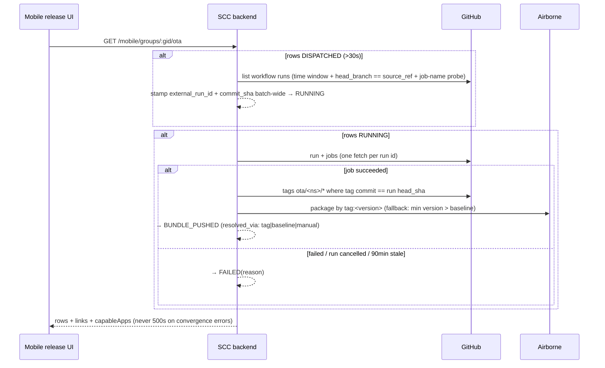
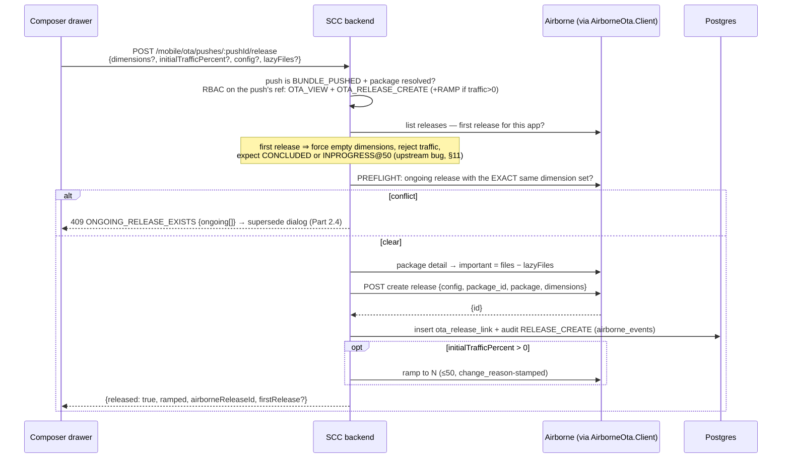

# OTA Releases inside Mobile Releases — Integration Design (v2.2)

**Date:** 2026-07-21 (v2.2 — restructured for readability; technically identical to the adversarially-reviewed v2.1, see §12)
**Status:** IMPLEMENTED 2026-07-22 (branch `airborne-ota-implementation`) — migration `0047-ota-push.sql`, backend (`Mobile/Types/Ota.hs`, `Mobile/Queries/OtaPush.hs`, `Mobile/Handlers/Ota.hs`, 5 routes in `Mobile/Routes.hs`, `Github.hs` head_branch + tag-sha extensions, `Core.AppError.ConflictWithPayload`, `preflightRamp` 100→50), frontend (`releases/otaApi.ts`, `components/ota/OtaPanel.tsx` incl. composer + supersede dialog, mounts in `ReleaseGroupDetail.tsx` + `ReleaseSummary.tsx`). Local verification done (build/tests/tsc green; GET/dispatch-guards/409/abandon/attach smoke-tested against dev DB). **Pending: E2E against real CI + airborne (needs PAT creds + user go-ahead — creates real runs/packages/releases), and the §11 open items.**

**Requirements:**
1. Push the OTA bundle from the mobile release's branch.
2. **The operator never needs to open the OTA dashboard/product.** Create (with targeting), ramp, conclude, revert, discard, status, history — all from the mobile release UI.
3. **Multiple bundle releases from the same branch for the same app**, repeatable, with sane supersession.

---

# Part 1 — The big picture

## 1.1 What this feature does, in one paragraph

Today, shipping a JS/asset hotfix means two tools: build the bundle via a GitHub Actions workflow, then open the **Airborne OTA dashboard** to create and roll out the release. This design puts both halves **on the mobile release group page**. From the same page where you watch native builds, you click **Push bundle** (builds from the group's branch), wait for it to turn green, then click **Release** — choose targeting and a traffic %, and manage the rollout (ramp → conclude, or revert) with inline buttons. The OTA dashboard still exists as an admin escape hatch, but you never *need* it.

## 1.2 The three systems and who does what

```
┌─────────────────┐  dispatch     ┌──────────────────┐  push files +  ┌──────────────────┐
│  SCC            │──────────────▶│  GitHub Actions  │───────────────▶│  Airborne server │
│  (this repo)    │  workflow     │  (ny-react-native │  create        │  (Superposition) │
│                 │               │  consumer-        │  PACKAGE       │                  │
│  UI + tracking  │◀──────────────│  airborne-ota)    │                │  packages,       │
│  + release      │  poll runs/   │                   │                │  RELEASES,       │
│  composition    │  jobs/tags    │  builds the JS    │                │  traffic %       │
│                 │               │  bundle from the  │                │                  │
│                 │───────────────────release branch──────────────────▶│                  │
│                 │  create release, ramp, conclude, revert, discard   │                  │
└─────────────────┘  (via the existing /airborne BFF)                  └──────────────────┘
```

- **SCC** — the UI, dispatching the CI workflow, tracking push status, and composing release operations. SCC never stores release state; it always reads it live from Airborne.
- **GitHub Actions** (`consumer-airborne-ota.yaml` in ny-react-native) — builds the bundle from a branch, uploads files, and creates an Airborne **package** (a versioned bundle sitting on the shelf — not yet on any device).
- **Airborne server** — owns packages and **releases** (a release = "serve package version N to devices matching these dimensions at X% traffic"). SCC's existing Airborne BFF product (`Products/AirborneOta/`) already proxies its full API with RBAC and auditing.

## 1.3 Glossary — the six words that matter

| Term | Meaning |
|---|---|
| **Push** | SCC's word for one CI build: "build a bundle from this branch and upload it as a package". Tracked in the `ota_push` table. Devices are **not** affected by a push. |
| **Package** | A versioned bundle stored in Airborne (version 1, 2, 3…). Inert until released. |
| **Release** | An Airborne experiment: serve package N to devices matching a **dimension set** at a **traffic %**. This is what actually reaches phones. |
| **Dimensions / targeting** | Key-value rules like `{city: bangalore}` selecting which devices a release applies to. Empty = all devices. |
| **Ramp** | Set the release's traffic to N% (**wire scale 0–50**; N ⇒ N% of matching devices). You can never ramp to 100. |
| **Conclude / Revert / Discard** | The three ways a release ends. **Conclude** = ship to 100% of matching devices (the only path to 100). **Revert** = conclude choosing the *old* bundle — ramped devices go back to stable. **Discard** = delete a release that was **never ramped** (Airborne rejects discard once traffic > 0). |

Release lifecycle (fixed by Airborne, SCC must respect it):

```
CREATED ──ramp──▶ INPROGRESS ──conclude──▶ CONCLUDED   (shipped to 100%)
   │                   │
   │                   └──revert (conclude→control)──▶ CONCLUDED (rolled back)
   └──discard──▶ DISCARDED                             (only legal while CREATED)
```

## 1.4 Bundle attribution — one dispatch, many apps, no mix-ups

A single **Push bundle** click builds bundles for *every* capable app in the group in one CI run. How does each app get the correct bundle?

```
One "Push bundle" click on the group page
        │
        ▼
ONE GitHub Actions run (matrix: app_variants × platforms)
        │
        ├── job "NammaYatri-Android"  ──catalyst──▶ namespace nammayatriv2      ──▶ package v15
        ├── job "NammaYatri-iOS"      ──catalyst──▶ namespace nammayatriv2-ios  ──▶ package v9
        └── job "Cumta-Android"       ──catalyst──▶ namespace chennaione        ──▶ package v22
        │
        ▼
SCC: one ota_push ROW per (app, platform), all sharing one dispatch_batch_id
```

Three layers of separation, each per-app:

1. **CI matrix** — the run is a matrix of jobs, one per (app, platform); each job builds exactly one app in its own isolated checkout, even when jobs share a runner pool.
2. **Namespace isolation (the hard guarantee)** — inside each job, catalyst maps (app name, platform) → that app's dedicated airborne namespace and uploads the package there. Airborne packages are keyed per namespace, so app A's bundle physically cannot appear in app B's package list. SCC doesn't enforce this; the storage model does.
3. **SCC row-level correlation** — one `ota_push` row per (app, platform), each carrying its own `airborne_app_ref`. Job status is matched per row by job name (`"<App>-<Android|iOS>"`) — Cumta can fail while NammaYatri succeeds, and the rows diverge honestly. Package version resolves per row from the repo tag **in that row's namespace** (`ota/<ns>/<ver>`, tag commit == run `head_sha`) — one shared run, but no shared version counter.

**SCC never touches bundle bytes.** CI uploads the bundle files into airborne's asset storage (CloudFront-served); only *devices* download them. What SCC fetches from airborne is metadata: the package identity by tag (post-CI, Decision E), the package's file/lazy lists at release-time (Flow C composition), and — live on every view — release status, dimension/cohort vocabulary, and analytics (Decision C: none of it cached in SCC).

The UI inherits this 1:1: one card per (app, platform), everything in it fetched by that card's `airborne_app_ref` — a card cannot display another app's bundle. The only genuine mix-up risk is **across batches** (two concurrent dispatches targeting the same namespaces, with no batch discriminator in job names) — which is exactly why Decision D serializes dispatch globally.

**Multiple bundles from the same branch, per app** — the normal iteration loop (R1/R6): every push mints a *new* package version in that app's namespace (catalyst does per-namespace version arithmetic with conflict-retry), so three pushes from `release/2026-07` give v15, v16, v17 — all on the shelf, none on devices. Each push is its own `ota_push` row with its `commit_sha`, so history shows exactly which branch commit produced which package. **Which bundle serves is decided at release time, not build time** — release the one you mean (older ⇒ rollback badge), supersede an ongoing release with identical targeting, or run different targeting concurrently (v16 to `{city: bangalore}` while v15 is stable everywhere else).

---

# Part 2 — What the operator sees (UI)

> **Implementation deltas (2026-07-23).** The shipped UI evolved past the mockups below during build-out; where they differ, the shipped behavior is the spec:
> - **Package-first create.** The card centers on "Releasable packages (this build)" — only packages with proven git lineage (`identical`/`ahead` of the build's anchor commit, §11b) or an SCC push of this group. Each has **Release…**; everything else collapses into "Not from this build: N packages · M inactive releases". Releases can be created **from a package with no push row** via `POST /mobile/groups/:gid/ota/release`, lineage-gated server-side.
> - **Composer**: first field is a **package selector** (this-build packages, provenance-labeled); required decisions are package + targeting + traffic; timeouts/properties/lazy-files prefilled behind Advanced. An **R7 seed button** offers "target this build's version (vX.Y.Z)" when the workspace defines a version-ish dimension. **Edit mode** (Edit… on CREATED this-build releases) reopens it prefilled from live detail with targeting locked and saves via the airborne update route.
> - **Foreign visibility is status-sensitive**: foreign releases show in an amber box only while INPROGRESS (serving devices); inert CREATED foreigners live in the collapsed line — the create-time preflight/supersede dialog owns them.
> - **Branch identity**: group header shows a branch chip when known; when a member's branch is missing, a single page-level banner (see 2026-07-24 deltas) offers the picker — after auto-resolution from CI runs has had first crack. The **picker is search-first** (any branch, typeahead); on adopt the server verifies the branch contains the anchor commit — a non-containing pick warns (squash-merge reality) and requires an explicit "Adopt anyway" (`acknowledgeMismatch`), logged.
> - **Provenance badges** everywhere packages/releases render: `this build · exact` / `this branch · +N` / `older than build · −N` / `different lineage` / `unknown provenance`, with the SCC push/link log as fallback. Release rows show the human version string (package tag) beside `pkg vN`.
> - **Metrics row**: downloads / applied / rollbacks+failures (7d) per ongoing release; renders nothing when analytics is unconfigured.
> - **Admin**: `MobileAppsAdmin` has an inline "OTA ref" editor (`PATCH /mobile/apps/:id {airborneAppRef}`; "" clears). **Runner pool** is chosen in the push UI (a selector defaulting to `ios-debug`, `rasmalai-new` as the alternative) and sent with every dispatch — the old `ota_runner_pool` server_config knob is REMOVED; a bare API call omitting `runner` falls back to `ios-debug` in code. Caveat: old release branches whose workflow file predates the `runner` input 422 on dispatch (GH validates inputs against the workflow at the dispatched ref).
>
> **Implementation deltas (2026-07-27):**
> - **Runner is per-dispatch UI state** (see Admin bullet above): `ota_runner_pool` server_config removed; both push toolbars default the selector to `ios-debug` and always send it.
> - **Tag resolution is newest-first** (Decision E note): same-commit re-pushes no longer resolve to the previous package.
> - **Pushes timeline UI**: each push block (row + expansion) carries a status-colored left edge (sky/amber/emerald/red); rows collapse to one line (only an actively-running push starts open); short failure reasons sit inline right, long ones wrap on their own line; rows with nothing behind them (pre-CI dispatch failures) get no expand caret; a "Locating CI run…" spinner line explains the DISPATCHED pre-binding window.
> - **Releases are the primary rows under a releasable package**: every airborne release cut from the package lists with status/traffic/dims/origin/date + open-link; the package recedes to a header whose button becomes "New release" (same package, new dimensions). Release rows also show the airborne `package.name` when upstream provides it. Toolbar bulk verbs still refuse ambiguity (`soleOngoing`: 2+ ongoing → disabled, "expand the row").
> - **Loading is stated in place** (shared `Spinner`): table ongoing-cell, card ongoing-release and packages sections show spinners on first fetch instead of premature empty-states; background polls stay silent.
> - **"via Airborne" links land on the Packages page**, which now has a Created column (derived from the index FILE's `created_at` — the packages API itself carries no timestamp; >200-versions clamp and missing file records render "—").
> - **Embedded card drops its duplicate identity** (`hideIdentity`) when the row above already names the app.
>
> **Implementation deltas (2026-07-24):**
> - **Branch auto-resolution (§11b Tier 1).** `source_ref` is recovered from the build's own CI run (`GET workflow runs?head_sha=` → `head_branch`) on group-page load — unanimity across matching runs required, NULL-only write, in-process cache. Verified over the full dev backlog: 65/66 resolved automatically; the one same-sha-two-branches rebuild correctly fell to the picker. Only ~13% of store builds came from `main` — never default to it. The picker remains for ambiguity and pruned run history.
> - **Anchor recovery covers all members.** Commit-from-tag recovery (and branch resolution) runs for EVERY group member — provider apps (tag form `<App>-v<ver>-<code>`) and disabled apps included; provenance is a build fact, not an OTA fact. The prefill script is now optional everywhere.
> - **One branch prompt per page.** Group page: a single page-level banner under the header ("Imported from store — no source branch known for X · platform"); the header pill and the OTA card's inner banner are gone there (`hideBranchPrompt`). The card keeps its own prompt only when mounted standalone on the release summary. Summary header shows a branch chip when `sourceRef` is known.
> - **Push gate widened to "has (or is about to have) an install base"**: on-store OR **superseded** (any track — stragglers still run it; the straggler-hotfix case) OR **in store review** (pre-positioning; a version-targeted release serves nobody until rollout). Never-distributed builds stay blocked. `OtaCapableApp.superseded` drives a composer guard: for superseded builds the version dimension is **pre-seeded** with the build's version, and an untargeted release requires an explicit confirm (old-branch JS must not silently serve newer natives).
> - **Unmapped apps are stated, not hidden**: group OTA section lists members without an airborne ref as inert rows ("no airborne app mapped" / "not available for provider apps"); a group with zero mapped apps shows a one-line note instead of no section; the summary page shows the same note in place of the card.
> - **Unified per-app RBAC** (supersedes the "no permission bridge" stance in §5.8): one autopilot grant `app_group="<name>/<platform>"` (or the fleet-wide `mobile/*` wildcard) carries BOTH build (`MOBILE_DISPATCH`…) and OTA (`OTA_*`) permissions — system Admin/Manager/Viewer tier both families. OTA checks accept legacy per-ref airborne-ota grants OR the unified grant (`requireOtaPermission`; `aliasGrantSlugs` at the route gate). Mobile verbs are per-app enforced server-side; reads are visible-but-inert. `GET /mobile/access` feeds per-row button states.

## 2.1 Where it lives

One new **OTA section** on the existing `ReleaseGroupDetail` page (the mobile release group page), below the native build rows. One **card per (app, platform)** that has an Airborne mapping (`app_catalog.airborne_app_ref`). The section is **hidden for debug groups** (v2 scope: production namespaces only) and hidden entirely if no app in the group has a mapping.

**Second mount point — the Release Summary page** (`ReleaseSummary.tsx`, the per-row release detail page — below the Store release card, alongside promote-to-review / rollout controls): the same `OtaPanel` component rendered once, with props `(appName, platform, releaseGroupId, sourceRef)` taken from the row the page already fetches. No new backend or state model. Identification is the same two-step join, scoped by the row: `(app_name, platform)` → `airborne_app_ref` decides **which airborne namespace** to read (releases/dimensions/analytics, live); `release_group_id` decides **which pushes belong here** (the group OTA response filtered to this row client-side — bundles built from *this release's* branch). Ongoing releases in the namespace still resolve provenance via the global link lookup, so the panel distinguishes "from this release" from "from group X · branch Y" — which matters most on a single-row page, where the namespace's ongoing release may predate the release being viewed.

**Store-sync rows (no branch)** — rows imported by store sync (`source_ref` NULL: SCC observed the version on the store but didn't build it) get the **operate-only** panel: release operations need only `airborne_app_ref` (derived from app+platform, not from the row), so viewing/ramping/concluding/reverting the namespace's ongoing releases works fully, with provenance badges pointing at whichever SCC-built group actually pushed them. **Push is disabled** with the stated reason until a branch is known; the pushes list is naturally empty. Most rows never stay branchless: on page load the §11b resolver recovers the anchor commit from the native tag and the branch from the build's own CI run (unanimous `head_branch`), NULL-only-written. Only genuinely ambiguous builds (same sha built from two branches) or pre-ledger rows wait for the human picker — there is still no free-text branch escape hatch. (The store-presence gate is trivially satisfied on these rows; the branch requirement is the independent AND condition that blocks.)

**Why the branch is load-bearing.** A bundle isn't fetched — it's *compiled*: the CI runner checks out ny-react-native at the dispatched ref and Metro-builds the JS + assets from that tree, so the branch **is** the bundle's contents. Which branch matters because a JS bundle only works inside a native binary that matches it (native modules, bridge methods, assets compiled into the APK/IPA). For SCC-built releases the pairing is structural: native binary and OTA bundle come from the same `source_ref` — the JS can only reference native code that exists in the installed binary. That is what "provenance" means here.

A hand-typed branch on a store-sync row wouldn't fail the build — CI builds whatever it's told. It breaks the *truth of the pairing*, three ways: (1) nobody knows what the live store binary was cut from, and a mismatched bundle fails as a **runtime crash on device** (`NativeModules.X is undefined` at boot), which nothing upstream catches — the fork SDK's auto-rollback softens the blast, but shipping crashes for devices to roll back is not a process; (2) per R7 the release reaches **every** installed version matching its dimensions, not just the store-sync row's version — the blast radius is the namespace's whole fleet; (3) the guess gets **recorded as fact** — `source_ref` on the push and link rows drives later supersede/rollback decisions and the `commit_sha` drift check, so a guessed value poisons the audit trail exactly where it's most trusted (branch names are also mutable pointers and typo-able). Backfill differs in kind, not ceremony: it's a one-time, audited assertion by someone who *verified* what the store version was built from — after which the normal dispatch flow applies with all its guarantees. A free-text field at dispatch time invites the same claim to be made casually at hotfix-o'clock; same data, opposite epistemics.

## 2.2 The OTA card

```
┌─ OTA · Namma Yatri · Android ────────────────────────────────────────────────┐
│                                                                              │
│  ONGOING RELEASE                                                             │
│  ● pkg v14 · INPROGRESS · 25% traffic · {city: bangalore}                    │
│    from this group · branch release/2026-07-hotfix · created by shivendra    │
│    ┌─ metrics ───────────────────────────────────────────┐                   │
│    │ downloads 12.4k · applied 11.9k · rollbacks 12      │                   │
│    └─────────────────────────────────────────────────────┘                   │
│    [ Ramp… ]  [ Conclude ]  [ Revert ]                                       │
│                                                                              │
│  LATEST PUSH                                                                 │
│  ✓ BUNDLE_PUSHED · pkg v15 · v2.4.1 · sha a1b2c3d · 12 min ago               │
│    [ Release… ]                                                              │
│                                                                              │
│  [ Push bundle ]                          ▸ Push & release history (7)       │
└──────────────────────────────────────────────────────────────────────────────┘
```

What each zone shows:

- **Ongoing release(s)** — fetched **live** from Airborne every 10–15s while the card is expanded (never cached in SCC). Status, traffic %, targeting, provenance ("from group X · branch Y" via the global link lookup — or "created outside SCC" if it truly was), and **decision metrics** (downloads / applied / rollbacks from the existing analytics routes) so a conclude-or-revert decision never forces the operator back to the dashboard. With the fork SDK, "rollbacks" includes **client auto-rollbacks** (bundles that crashed before `markBundleSafe`) — a genuine health signal, not noise: a rising count means revert.
- **Inline verbs, status-aware** — only the legal operations for the release's state are shown:

  | Release status | Buttons shown |
  |---|---|
  | CREATED (never ramped) | Ramp… · Edit… · Discard |
  | INPROGRESS (ramped) | Ramp… · Conclude · Revert |
  | CONCLUDED / DISCARDED | none (history only) |

- **Latest push** — the most recent `ota_push` row with its live status chip: `DISPATCHED → RUNNING → BUNDLE_PUSHED` (or `FAILED` with reason). `RUNNING` shows a link to the GitHub run. `BUNDLE_PUSHED` enables **Release…**.
- **Push bundle** — dispatches the CI workflow on the group's branch. Disabled (with an explanatory tooltip) while **any** OTA push is active anywhere in SCC — dispatch is globally serialized because the CI pipeline itself is (§Part 5, Decision D).
  - **App selection** — the dispatch takes optional `apps`/`platforms` filters, mirroring the native dispatch flow: from a 4-app group you can push for just 2. The pool is `capableApps` (members with `airborne_app_ref`); SCC passes the selection straight through as CI's `app_variants`, so CI builds only what was picked. One caveat: `platforms` applies to **all** selected apps (CI takes the cross-product) — "app A Android + app B iOS" needs two sequential dispatches.
  - **When pushing is allowed — store-presence gate, per (app, platform)**: Push bundle is enabled for an app only when the group's native build for it is **on the store** — internal track / rolling out / live (Play internal; TestFlight / Prepare-for-Submission on iOS) — read from `store_status` + the row's rollout state. Full preconditions: production group, app has `airborne_app_ref`, **native build on-store**, no active push globally (Decision D), `MOBILE_DISPATCH`. Apps not yet on-store appear disabled in the picker with the reason; the dispatch handler re-checks and rejects them. Consequences: no bundle can exist for a native build that reached no store, and ABORTED/REVERTED groups are naturally unpushable (they never reached a store) — no warn-but-allow. Trade-off accepted: no pre-warming a bundle during the native build (internal-track push lands minutes after build success anyway). Compatibility remains a *release*-step concern (R7 notice).
- **History** (collapsed) — every past push and every release link, newest first, each release row showing live-fetched status. Discarded/concluded releases stay visible forever — that's the audit trail.

## 2.3 The release composer (drawer)

Opens from **Release…** on a `BUNDLE_PUSHED` push:

```
┌─ Release OTA bundle ── Namma Yatri · Android ──────────────┐
│                                                            │
│  Package     v15 (from this push)          [⚠ if older     │
│                                             than current]  │
│                                                            │
│  Targeting   ┌────────────────────────────────┐            │
│              │ city      = bangalore        ✕ │            │
│              │ [+ add rule]  [+ cohort]       │            │
│              └────────────────────────────────┘            │
│              ⚠ overlaps ongoing release {city:bangalore,   │
│                os:android} — Superposition decides which   │
│                wins on shared devices                      │
│                                                            │
│  Initial traffic   [ 10 ]%   (0–50; 100% only via          │
│                               Conclude later)              │
│                                                            │
│  ⓘ This release reaches ALL devices matching the           │
│    targeting, on every installed app version. Bundle ↔     │
│    native compatibility is on you.                         │
│                                                            │
│  ▸ Advanced (boot timeout, config properties, lazy files)  │
│                                                            │
│                      [ Cancel ]   [ Create release ]       │
└────────────────────────────────────────────────────────────┘
```

Composer behaviors worth calling out:

- **Targeting vocabulary** (dimension names, cohorts) comes from the existing `/airborne/:app/dimensions*` routes.
- **Downgrade badge**: if this push's package version is *older* than the app's current stable/ongoing, a visible "older than current" badge + confirmation appears — rollback is a supported one-click feature, accidental downgrade is not silent.
- **Overlap warning**: Airborne only rejects releases with the *exact same* dimension set; overlapping sets (`{city:blr}` vs `{city:blr, os:android}`) coexist silently. The composer warns client-side because the server never will.
- **Compatibility notice**: Airborne has no native-version gating — stated plainly in the drawer (rule R7).
- **First release for an app** is special: the composer forces empty targeting, disables initial traffic, and labels it a "bootstrap release" (Airborne auto-ramps and auto-concludes the first release; a known upstream bug can leave it INPROGRESS@50 — surfaced honestly, §11).

## 2.4 The supersede dialog

If you hit **Create release** while an ongoing release already has the **exact same** dimension set, SCC's preflight catches it (Airborne would only return a generic 400) and opens:

```
┌─ An ongoing release is in the way ─────────────────────────┐
│  pkg v14 · INPROGRESS · 25% · {city: bangalore}            │
│  from this group · branch release/2026-07-hotfix           │
│                                                            │
│  Choose what happens to it first:                          │
│                                                            │
│  ○ Conclude v14 — ships v14 to 100% of matching devices;   │
│     they'll then move to v15 when it ramps                 │
│  ○ Revert v14 — the 25% on v14 go back to stable first     │
│                                                            │
│  (Discard is shown instead of these two when the release   │
│   was never ramped — nothing was serving, nothing changes) │
│                                                            │
│              [ Cancel ]   [ Do it, then create v15 ]       │
└────────────────────────────────────────────────────────────┘
```

Two explicit steps by design — the operator decides the old release's fate; each option carries one sentence of device-consequence copy.

## 2.5 What you see with limited permissions

Building bundles and controlling device traffic are separate powers (no implicit bridge between the products):

| Your grants on this app's ref | What the card shows |
|---|---|
| none (`OTA_VIEW` missing) | push statuses only; release ids inert; no composer |
| `OTA_VIEW` | + live release statuses, history, metrics; no verbs |
| + `OTA_RELEASE_CREATE` | + the Release… composer |
| + `OTA_RELEASE_RAMP` / `_CONCLUDE` / `_DISCARD` | + the matching inline verbs |

The card derives this from the existing `/airborne/access` response (per-ref permission sets), **not** from `PermissionGate` alone — `PermissionsContext.isAdmin` short-circuits `hasPermission` across products, which would show an autopilot admin enabled buttons that all 403. Push/dispatch actions are gated by `autopilot/MOBILE_DISPATCH` as usual.

---

# Part 3 — Step by step: shipping an OTA hotfix

**Scenario:** the group for `release/2026-07` shipped natively; a JS bug needs a hotfix to Bangalore users first, then everyone.

**Step 0 — prerequisites.** The app row in `app_catalog` has `airborne_app_ref` set (e.g. `movingtech~nammayatriv2`); the group is a production group; the app's native build from this group is **on the store** (internal / rolling out / live — the push gate, Part 2.2); you hold `MOBILE_DISPATCH` (to build) and the `OTA_*` grants (to release).

**Step 1 — fix on the branch.** Commit the JS fix to `release/2026-07` (the group's `source_ref`). SCC shows the push's `commit_sha` beside the native build's sha, so branch drift is visible.

**Step 2 — Push bundle.** On the group page, OTA section → **Push bundle** → pick bump (patch) → confirm. SCC records expectation rows and dispatches the CI workflow on the branch. If another OTA push is active anywhere, you get a clear 409 — wait or ask its owner to abandon it.

**Step 3 — wait for green.** The card polls every 15s while active: `DISPATCHED` (run being located) → `RUNNING` (link to the GitHub run) → `BUNDLE_PUSHED` with the resolved package version (e.g. pkg v15). On `FAILED`, the reason (job failed / run cancelled / timed out) is on the row; push again when fixed. If the build succeeded but the package didn't auto-resolve, the **Attach package version** verb fixes it manually.

**Step 4 — Release… (create).** Open the composer on pkg v15 → targeting `city = bangalore` → initial traffic **10** → Create. SCC preflights conflicts, composes the Airborne create call, ramps to 10, links + audits. The release appears as `INPROGRESS · 10% · {city: bangalore}`.

**Step 5 — ramp up.** After checking the metrics tile (downloads/applied/rollbacks), **Ramp…** → 25 → later 50. 50 is the wire ceiling; there is no ramp-to-100.

**Step 6 — go everywhere.** Two idiomatic paths:
- **Conclude** the Bangalore release (it becomes stable for that context), then push nothing new — create a second release with **empty targeting** from the same package for everyone else; or
- simply **Conclude** if the targeting was already empty.

**If it goes wrong at any point:** **Revert** (ramped cohort returns to stable, one click) — or push a fixed bundle (Step 1–3), hit Release…, and let the supersede dialog retire the bad release first. Releasing an *older* package is also legal — the composer badges it as a rollback.

**Repeat forever.** Fix → push (patch bump) → supersede → ramp → conclude, all from the group page — including on COMPLETED groups (that *is* the hotfix path, rule R8).

---

# Part 4 — Data flow, UI → backend → external

Four flows cover everything. Flows C and D are where "never open the dashboard" is earned.

## Flow A — Push bundle

```mermaid
sequenceDiagram
    participant UI as Mobile release UI
    participant BE as SCC backend<br/>(Mobile/Handlers/Ota.hs)
    participant DB as Postgres
    participant GH as GitHub Actions

    UI->>BE: POST /mobile/groups/:gid/ota/dispatch {versionBump, apps?, platforms?}
    BE->>BE: prod group? capable apps = members with airborne_app_ref<br/>AND native build on-store (internal|rolling out|live)
    BE->>DB: advisory lock; any non-terminal ota_push anywhere?
    alt one exists
        BE-->>UI: 409 (who/where, so the user knows what's blocking)
    else clear
        BE->>BE: snapshot per-namespace baseline package version (best-effort)
        BE->>DB: insert ota_push rows, status DISPATCHED (one dispatch_batch_id)
        BE->>GH: workflow_dispatch consumer-airborne-ota.yaml on source_ref
        BE-->>UI: 200 {rows}
    end
```

Insert-then-dispatch: a failed dispatch marks the rows FAILED — no ghost expectations. All CI inputs are passed explicitly.

## Flow B — Status convergence (no background poller)

Convergence is a **side-effect of the UI's GET** — same doctrine as store sync. The frontend polls `GET /mobile/groups/:gid/ota` every 15s **only while a push is active**.



Escape hatches so a push can never wedge the system: **abandon** (force a stuck row terminal — reopens the global dispatch guard) and **attach package version** (manual resolution, validated against the live package list; both audited).

## Flow C — Create a release (the one new composition endpoint)

Everything in one atomic, audited backend intent — the reason this isn't frontend-orchestrated is half-failures: a create that succeeds but whose link/audit/ramp is lost.



The preflight exists because Airborne reports the conflict only as a generic **400/AB_005** (same code as every validation failure, no conflicting-release id — there is no 409 upstream). A ramp failure *after* a successful create returns `released:true, ramped:false` — the inline Ramp button recovers; nothing is orphaned.

## Flow D — Ramp / Conclude / Revert / Discard (no new backend)

```mermaid
sequenceDiagram
    participant UI as OTA card verbs
    participant BFF as Existing airborne BFF<br/>(/airborne/:app/...)
    participant AB as Airborne

    UI->>BFF: POST ramp {traffic ≤ 50, change_reason}
    UI->>BFF: POST conclude {chosen_variant, change_reason}
    Note over UI,BFF: Revert = conclude choosing the CONTROL variant.<br/>SCC auto-selects the sole experimental/control variant<br/>from live detail; >1 experimental ⇒ explicit picker.
    UI->>BFF: POST discard  (CREATED-only — upstream rejects otherwise)
    BFF->>AB: proxied, RBAC-checked per ref, audited in airborne_events
    UI->>BFF: GET releases / release detail / dimensions / analytics (reads, 10–15s poll)
```

The mobile frontend imports the airborne product's **api functions only** (not its page components). No mutation route is duplicated; RBAC, auditing, and `change_reason` stamping ride along for free. Status is **always read live** — SCC caches nothing about release state (Decision C).

---

# Part 5 — Technical reference

*(The dense, reviewed core — for implementers. Everything above is derived from this.)*

## 5.1 Ground truth (verified on disk; corrected by review)

- **Mobile releases** carry the branch: `release_tracker.source_ref` is the `workflow_dispatch` ref (`Workflow.hs:859`); one row per (app, platform), grouped by `release_group_id`; build type is uniform per group (stamped once at create). GitHub App dispatch, run-candidate correlation and job polling live in `Mobile/Github.hs` — all parameterized by workflow file, genuinely reusable.
- **The OTA CI pipeline** (`consumer-airborne-ota.yaml`) builds the bundle from the dispatched ref, versions via catalyst (+conflict-retry patch bumps), pushes files + creates an **airborne package** (tag = version), tags the repo `ota/<ns>/<ver>` (with `.N` suffix on re-tags). It does **not** create the airborne release. One global CI concurrency group (`consumer-airborne-ota`, no cancel-in-progress): one run executes, at most one queues, **a third dispatch cancels the queued one**.
- **The airborne BFF** (`Products/AirborneOta/`) already proxies the full release lifecycle, RBAC-gated per composite ref `<org>~<app>` and audited (`airborne_events`). `Client.hs` holds the single-flight PAT cache; no circular deps — `AirborneOta.Client`/`Queries` import only `Core.*`.
- **Airborne release model (corrected):**
  - Release = Superposition experiment. Lifecycle: **CREATED → (INPROGRESS | DISCARDED); INPROGRESS → CONCLUDED.** **Discard is only legal while CREATED** (never ramped) — a ramped release can only be *concluded* (ship) or *reverted* (conclude choosing control → traffic returns to stable) (`release.rs:1182-1186`).
  - **Traffic scale is 0–50 on the wire**: ramp N ⇒ N% of matching devices serve the new bundle, hard ceiling 50; **100% of devices is reachable only via conclude**. The dashboard clamps input to 50; SCC's existing `preflightRamp` wrongly allows 51–100 (tighten to 50 during implementation) (`release.rs:486-494`, dashboard release page:211-215, SCC `Routes.hs:404-406`).
  - **One ongoing release per *exactly identical* dimension set** (`release.rs:383-396`, strict-mode context match). Overlapping-but-not-identical sets (`{city:blr}` vs `{city:blr,os:android}` vs `{}`) coexist freely upstream. The violation returns **HTTP 400, generic code AB_005** — same code as every other validation failure, no conflicting-release id. There is no 409.
  - **First release per app is special-cased upstream**: create auto-ramps to 50 and auto-concludes — but the auto-conclude uses a hardcoded variant id that is wrong for package version > 1, and the error is swallowed (`release.rs:479-509`), so a first release can land INPROGRESS@50 instead of CONCLUDED. "First release must be untargeted" is a **dashboard convention, not a server rule** — the server would accept a targeted first release and instantly make it stable for that context only.
  - `POST /api/releases` **returns the release id** as top-level `id` (`release/types.rs:59-60`).
  - Same package may be released repeatedly (sequentially after conclude/discard, or concurrently under different exact dimension sets) — no per-package guard. Rollback-by-re-release is legal.
  - **No native-version gating**: an OTA release serves ALL devices matching its dimensions regardless of installed app version — compatibility is the operator's problem (R7).
- **App identity join**: none exists today; catalyst.yaml maps app_catalog names × platform → namespace (org `movingtech`, consumer only; **debug namespaces exist only for Cumta and differ from prod**). `mbcOtaNamespace` is a dormant always-null placeholder.
- **Which server are we actually running against?** (verified 2026-07-22) Prod SCC uses the default `SC_AIRBORNE_URL = https://airborne.juspay.in` (Juspay-hosted). Fingerprint: the public serve endpoint (`/release/movingtech/nammayatriv2`) returns file entries **without** the `size` field that upstream added on 2026-06-30 (`6a97b2b3`), so the deployed server predates that — it sits between the fork point (~2026-04-30) and 2026-06-30. All five load-bearing behaviors were source-diffed between the pinned fork commit `99339d6` and upstream `main` (2026-07-22) and are **identical at both ends of that window**: discard-CREATED-only guard, exact-match ongoing conflict as generic 400 (`check_non_concluded_releases`, `DimensionMatchStrategy::Exact`), first-release auto-ramp-50 + swallowed auto-conclude (`let _ =`, hardcoded `-experimental_1` variant id), `CreateReleaseRequest` shape, and top-level `id` in the create response. The preflight logic therefore targets the running behavior regardless of the exact deployed commit. (Upstream's changes in the window are additive: redis-cache params, `ServeFile.size`, open-feature provider.)
- **Fork SDK behaviors (nammayatri/airborne, device-side only — no server/API changes, nothing here alters the design):** on-demand update APIs + background download worker; `markBundleSafe` + RollbackStore (unconfirmed bundles auto-roll-back and the version is blacklisted on-device); iOS silent updates; OTA workspace pruned on native app update (fresh native installs boot on bundled assets); `checkForUpdate` reports `available` on *any* version difference (downgrades are real updates); sticky traffic toss (a device's ramp-cohort assignment persists across % changes).

## 5.2 Decisions

**Decision A — push = dispatch-and-track.** SCC dispatches the existing CI workflow on `source_ref` and records expectation rows in `ota_push`, converged **on demand** (GET-driven, like store sync — no background poller). Version arithmetic stays in CI; SCC observes outcomes.

**Decision B — release ops reuse the existing airborne BFF; only *creation* gets a new composition endpoint.** "Never open the dashboard" is a UI requirement, not an API one. Ramp/conclude/revert/discard/update and all reads are already implemented, enforced, audited and `change_reason`-stamped under `/airborne/:app/...` — the mobile frontend calls those routes. The one new backend piece is **`POST /mobile/ota/pushes/:pushId/release`** (Flow C): preflight → compose create (+optional ramp ≤50) → link row → audit. Upstream 400s that slip through the preflight race are matched on the known message substring as a backstop; all other 400s surface as plain errors, never as the supersede dialog.

**Decision C — linkage stored for SCC-created releases, status always live.** `ota_release_link` records identity + intent (targeting snapshot) at create; status/traffic are never cached in SCC. Live release lists surface releases created elsewhere too — and links are resolved **globally by (ref, release id)**, not per group, so a release created from *another* group's push is badged "from group X / branch Y", not "external" (provenance is exactly what supersession decisions need).

**Decision D — OTA dispatch is serialized globally per workflow file, not per group.** The CI concurrency group is global and job names carry no batch discriminator, so two concurrent SCC batches (or SCC + a manual dispatch) can cross-wire run correlation and package attribution. SCC therefore 409s a dispatch while **any** non-terminal `ota_push` row exists (any group), takes an advisory lock around check+insert+dispatch, and additionally filters run candidates by `head_branch == source_ref`. This matches CI reality (runs serialize anyway) and removes the whole cross-attribution class.

**Decision E — package resolution is run-correlated, not watermark arithmetic.** Primary: after job success, read the repo tags `ota/<ns>/*` created by *this* run (tag target commit == run `head_sha`; one deref call for annotated tags) → `final_version` from the tag name → package by `tag:<version>` upstream. **Candidates are tried newest-version-first**: re-pushing the *same commit* mints another ota tag on the same sha, so listing order once resolved a fresh push to the PREVIOUS package (v8 stamped when CI had just built v9) — the numeric-desc sort makes the newest matching tag win. Fallback: min package `version` > pre-dispatch baseline. Last resort: the operator **attach-package** verb (validated against the live package list, audited). A push is therefore never permanently unreleasable, and a NULL baseline (airborne unreachable at dispatch) only disables the fallback, not resolution.

**v2 scope guard — production groups only.** A single `airborne_app_ref` column cannot express the debug↔prod namespace split (only Cumta has debug namespaces, and they differ). The OTA section is **hidden for debug groups** in v2; if debug OTA is ever wanted, extend the mapping to (app, platform, env) — noted in §11.

**Rejected:** frontend-orchestrated create (half-failures, no link row, no single audited intent); mirroring release state into SCC (drift; airborne is SSOT); Runner-driven spec now (no unattended progression needed yet — evolution path §10); reusing airborne page components in mobile pages (param/theme-scoped; import api functions only).

## 5.3 Component structure

| Component | Responsibility |
|---|---|
| `0046-ota-push.sql` | `app_catalog.airborne_app_ref` + prod seeds; `ota_push`; `ota_release_link` |
| `Mobile/Types/Ota.hs` | status ADT, req/resp types |
| `Mobile/Queries/OtaPush.hs` | `ota_push` / `ota_release_link` CRUD (raw SQL, AirborneOta.Queries idiom) |
| `Mobile/Handlers/Ota.hs` | dispatch (global lock), convergence, release composition + conflict preflight, attach/abandon verbs, group status assembly |
| `Products.AirborneOta.Client` (imported) | authenticated airborne calls — one-way dep, shares the PAT single-flight cache |
| `Products.AirborneOta.Queries.insertAirborneEvent` (imported) | audit parity for composed create/ramp |
| `Mobile/Github.hs` (reused) | `dispatchWorkflow`, run candidates (+`head_branch` filter), job polling, tag listing |
| `releases/components/OtaPanel.tsx` (+children) | per-(app,platform) cards: pushes, ongoing releases with inline ops + decision metrics, composer drawer, supersede dialog |
| `releases/components/OtaTargetingEditor.tsx` | compact dimension/cohort rules; vocabulary via existing `/airborne/:app/dimensions*`; `;` rejected in values |
| airborne-ota `api.ts` (functions only) | `fetchOtaReleases/Release`, `rampOtaRelease`, `concludeOtaRelease`, `discardOtaRelease`, `fetchOtaDimensions/Cohort`, analytics fetchers |

## 5.4 API design

```
GET  /mobile/groups/:gid/ota                          Protected 'AP_RELEASE_VIEW
→ { available, groupSourceRef, activePush,            -- available=false for debug groups
    rows: [{ id, appName, platform, airborneAppRef, env, status,     -- DISPATCHED|RUNNING|
             requestedBump, sourceRef, externalRunId?, runUrl?,      --   BUNDLE_PUSHED|FAILED
             commitSha?, finalVersion?, packageVersion?, resolvedVia?,
             error?, dispatchedBy, dispatchedAt, updatedAt }],
    links: [{ linkId, airborneAppRef, airborneReleaseId, packageVersion,
              dimensions?, createdBy, createdAt,
              groupId, groupLabel?, sourceRef }],     -- GLOBAL per ref (cross-group provenance)
    capableApps: [{ appName, platform, airborneAppRef,
                    pushEligible, ineligibleReason? }] }  -- store-presence gate (Part 2.2):
                                                          --   eligible = native build on-store

POST /mobile/groups/:gid/ota/dispatch                 Protected 'AP_MOBILE_DISPATCH
     { versionBump, apps?, platforms?, notifySlack? }
→ 200 { dispatched, rows } | 400 | 404 | 409 (any active OTA push, globally)

POST /mobile/ota/pushes/:pushId/release               route: 'AP_RELEASE_VIEW; in-handler:
     { dimensions?: {k:v}, initialTrafficPercent?,     OTA_VIEW + OTA_RELEASE_CREATE
       config?: {bootTimeout?, releaseConfigTimeout?,  (+OTA_RELEASE_RAMP if ramping) on the ref
                 properties?}, lazyFiles?: [fileKey] }
     -- initialTrafficPercent: 0–50 (wire scale; N ⇒ N% of matching devices; 100% only via conclude)
→ 200 { released, ramped, link, airborneReleaseId, firstRelease? }
| 409 { code: "ONGOING_RELEASE_EXISTS",               -- from SCC's own preflight
        ongoing: [{ airborneReleaseId, status, packageVersion?, trafficPercentage?,
                    dimensions?, link? }] }           -- link resolved globally when SCC-created

POST /mobile/ota/pushes/:pushId/abandon               Protected 'AP_MOBILE_DISPATCH
POST /mobile/ota/pushes/:pushId/attach-package        Protected 'AP_MOBILE_DISPATCH
     { packageVersion }                               -- validated against live package list; audited
```

Later additions (implemented):

```
POST /mobile/groups/:gid/ota/release              route: 'AP_RELEASE_VIEW; in-handler OTA_* RBAC
     { airborneAppRef, packageVersion, packageTag?,   -- package-born release (no push row);
       dimensions?, initialTrafficPercent?, config?,  -- allowed ONLY when git proves lineage
       lazyFiles? }                                   -- (identical|ahead vs the build anchor)

POST /mobile/groups/:gid/ota/provenance           'AP_RELEASE_VIEW — §11b resolver
     { airborneAppRef, packages: [{version, tag?}] }
→ { anchor: {commitSha?, sourceRef?, resolvedVia: scc|native-tag|none},
    packages: [{packageVersion, commitSha?, repoTag?, relation, aheadBy?, behindBy?}] }

POST /mobile/groups/:gid/ota/adopt-branch         'AP_MOBILE_APP_MANAGE
     { airborneAppRef, branch, acknowledgeMismatch? } -- server re-validates containment;
→ OtaProvAnchor                                       -- mismatch → 409 BRANCH_NOT_CONTAINING
                                                      -- unless explicitly acknowledged
```

(A `GET …/ota/branches` candidates endpoint existed briefly and was **removed** — the picker is search-first via the existing `/mobile/branches` search.) `PATCH /mobile/apps/:id` additionally accepts `airborneAppRef` ("" clears).

Everything else reuses `/airborne/:app/...` from the mobile frontend: release list/detail (joined client-side to `links` by release id), ramp/conclude/discard/update, dimensions + cohort reads, analytics reads. No duplicated mutation routes; no read mirrors. Implementation note: tighten the existing `preflightRamp` bound 100→50 while here.

## 5.5 Database schema

```sql
ALTER TABLE app_catalog ADD COLUMN airborne_app_ref TEXT;   -- '<org>~<app>', prod namespace; NULL = no OTA
-- seeds: consumer prod namespaces from catalyst.yaml (org movingtech), per platform row

CREATE TABLE ota_push (
  id UUID PRIMARY KEY DEFAULT gen_random_uuid(),
  mobile_release_group_id TEXT NOT NULL,        -- release_tracker.release_group_id (no FK)
  app_name TEXT NOT NULL, platform TEXT NOT NULL,
  airborne_app_ref TEXT NOT NULL, env TEXT NOT NULL,
  requested_bump TEXT NOT NULL, status TEXT NOT NULL,
  source_ref TEXT NOT NULL, dispatch_batch_id UUID NOT NULL,
  external_run_id BIGINT, commit_sha TEXT,
  baseline_package_version INT, package_version INT, final_version TEXT,
  resolved_via TEXT,                            -- tag|baseline|manual
  error TEXT, dispatched_by TEXT NOT NULL,
  dispatched_at TIMESTAMPTZ NOT NULL DEFAULT now(),
  updated_at TIMESTAMPTZ NOT NULL DEFAULT now()
);
CREATE INDEX idx_ota_push_group  ON ota_push (mobile_release_group_id, dispatched_at DESC);
CREATE INDEX idx_ota_push_active ON ota_push (status) WHERE status IN ('DISPATCHED','RUNNING'); -- global guard

CREATE TABLE ota_release_link (                 -- SCC-created releases; 1 push : N links
  id UUID PRIMARY KEY DEFAULT gen_random_uuid(),
  ota_push_id UUID NOT NULL REFERENCES ota_push(id) ON DELETE CASCADE,
  airborne_app_ref TEXT NOT NULL, airborne_release_id TEXT NOT NULL,   -- TEXT: superposition id
  package_version INT NOT NULL,
  dimensions JSONB,                             -- targeting snapshot (intent record)
  created_by TEXT NOT NULL,
  created_at TIMESTAMPTZ NOT NULL DEFAULT now(),
  UNIQUE (airborne_app_ref, airborne_release_id)         -- enables the global provenance lookup
);
CREATE INDEX idx_ota_release_link_push ON ota_release_link (ota_push_id);
CREATE INDEX idx_ota_release_link_ref  ON ota_release_link (airborne_app_ref);
```

Links are **never deleted** on conclude/discard — the history list shows every link with live-fetched status, so a discarded hotfix stays auditable from the group page. Pushes stay out of `release_tracker` (mobile lists/group logic/uniqueness untouched).

## 5.6 Convergence details (Flow B, exact thresholds)

- `DISPATCHED` >30s: resolve run — candidate window + `head_branch == source_ref` + job-name probe (`"<App>-<Android|iOS>"`); stamp `external_run_id`+`commit_sha` batch-wide → `RUNNING`. >15 min no candidate → `FAILED(run_lookup_timeout)`.
- `RUNNING`: one run+jobs fetch per run id. Run conclusion `cancelled` → `FAILED(cancelled)` (a queued run is cancelled by a third dispatch — must be a defined outcome). Job success → resolve package per Decision E (`resolved_via` recorded) → `BUNDLE_PUSHED`. Job failure/timeout → `FAILED`. Resolution failure → `BUNDLE_PUSHED` with null package fields, retried on later GETs. **RUNNING staleness timeout (90 min) → `FAILED(stale)`.**
- All upstream failures degrade (log, leave row); the GET never 500s on convergence.

## 5.7 Multi-bundle / multi-release rules (R1–R8)

- **R1 — Push is always safe, and globally serialized.** Any number of pushes from the branch; nothing reaches devices until released. One active push batch across SCC (Decision D); CI executes one run at a time. History accumulates newest-first.
- **R2 — Release the package you mean; rollback is a labeled feature.** Any `BUNDLE_PUSHED` push is releasable (typical: latest). Releasing an *older* package = rollback — explicit "older than current" badge + confirmation (Part 2.3). With the fork SDK, downgrades genuinely reach devices (`checkForUpdate` fires on any version difference); the stock upstream SDK ignores downgrades in on-demand checks.
- **R3 — Identical dimension set ⇒ supersede (status-aware).** SCC's preflight detects the conflict (upstream only emits a generic 400) and opens the supersede dialog: Discard (CREATED-only) / Conclude / Revert, then retry. Fork-SDK caveat: a device that auto-rolled-back a bundle blacklists that package version and will not take it again — recovering from a bad release requires a **new push** (new package version), not a re-release of the same package.
- **R4 — Non-identical sets coexist — including overlapping ones.** Upstream blocks only *exact* duplicates. The composer warns on subset/superset overlap with live ongoing sets (upstream never will); overlap resolution on devices is Superposition's, invisible to the operator.
- **R5 — Every ongoing release is visible with true provenance.** The ongoing list is live; SCC-created releases resolve their link **globally** — a release from another group is badged "from group X · branch Y", never "external" unless it truly came from outside SCC.
- **R6 — Iteration loop.** Fix on branch → push (patch bump) → supersede-release → ramp (≤50) → conclude — repeatable indefinitely from the group page. `commit_sha` per push, shown beside the native builds' sha, exposes branch drift.
- **R7 — Compatibility is explicit, not implied.** Airborne has no native-version gating: this release reaches **all** devices matching its dimensions, old and new app versions alike. The composer states this in a visible notice; if the workspace defines a version dimension, the composer offers a default rule seeded from the group's native version. Bundle/native compatibility remains an operator responsibility.
- **R8 — Group lifecycle: OTA outlives the native release; pushing requires store presence.** *Operating* (view, ramp, conclude, revert, discard, release-from-existing-push) stays fully available on COMPLETED groups — that *is* the hotfix path. *Pushing* is gated per (app, platform) on the native build being on-store (internal / rolling out / live — see Part 2.2), so ABORTED/USER_ABORTED/REVERTED groups are naturally unpushable rather than warn-but-allowed; any releases already created from such a group remain operable.

## 5.8 RBAC — unified per-app grants (revised 2026-07-24)

- **One grant covers both surfaces.** A `sc_person_deployment_access` row `(autopilot, app_group="<name>/<platform>")` — or the fleet-wide wildcard `"mobile/*"` (matches every mobile key, structurally never a BE deployment: mobile keys contain `/`, server names don't) — carries BOTH families. `allPermissions Autopilot` includes the OTA family, so system **Admin/Manager/Viewer** tier both (Manager lacks `OTA_RELEASE_DISCARD`/`OTA_APP_MANAGE`; Viewer = views + `OTA_VIEW`). Precedence: exact app key > `mobile/*` > product-level baseline (`deploymentRowFor`). Wire names: autopilot perms have NO `AP_` prefix; `OTA_*` keeps its prefix.
- **Build verbs** (`MOBILE_DISPATCH`: dispatch/abandon/attach; promote/rollout/revert/create) are enforced **per app row** in the handlers (`requireAppPerm[All]`); reads are visible-but-inert. `MOBILE_APP_MANAGE`: catalog edit is per-app, catalog create and fleet enumeration are product-level-only (`requireProductPerm`).
- **OTA verbs** accept the legacy per-ref airborne-ota grant OR the unified autopilot grant (`requireOtaPermission` / `requireOtaPerm` — ref resolved to its app row via `airborne_app_ref`; `aliasGrantSlugs "airborne-ota" = ["autopilot"]` at the route-level product gate). Legacy per-ref grants remain the escape hatch for refs with no catalog row; the admin UI no longer offers airborne-ota as a grantable product/surface.
- **Frontend gating**: `/airborne/access` (per-ref sets, unified-grant-aware) for OTA panels; `GET /mobile/access` (per-row `mobilePerms`/`otaPerms`) plus `hasPermission(product, action, "<name>/<platform>")` (deployment-first with wildcard + alias fallbacks) for mobile verbs; OTA fetches use `retry:false` and degrade the card on 403.
- **Audit**: composed create/ramp write `airborne_events` with the SCC actor (parity with airborne routes); dispatch/abandon/attach are recorded on `ota_push` rows (actor columns) — `change_reason` stamped wherever upstream accepts it.

## 5.9 Caching

| What | Where | Invalidation |
|---|---|---|
| GitHub installation token | existing MVar | 60s pre-expiry |
| Airborne PAT | existing single-flight MVar | ~30s pre-expiry + daily keepalive |
| Push status | `ota_push`, converged on GET | frontend polls 15s only while `activePush` |
| Baseline snapshot | immutable on the row | never |
| Live release status/detail | react-query on existing routes, per expanded card, 10–15s, `retry:false` | on mutation success |
| Decision metrics | react-query on existing analytics routes, 60s, only while card expanded | standard |
| Targeting vocabulary | react-query, 60s staleTime, on composer open | on composer open |
| name↔namespace mapping | `app_catalog.airborne_app_ref` | manual (migration / Apps admin) |

No SCC-side cache of airborne release state, ever (Decision C).

## §10 Scaling assumptions & evolution

- **Single replica**: advisory lock covers dispatch; convergence races are benign. Multi-replica: same locks, no design change.
- **Call budget**: ≤2 GH calls per group per poll while active+watched; release/metrics reads per expanded card only.
- **Global dispatch serialization** is the honest ceiling — CI serializes anyway. If OTA volume ever outgrows one-at-a-time, the fix is upstream first (per-app concurrency groups + a run discriminator echoed into job names), then SCC can relax to per-namespace guards.
- **Unattended progression** (auto-release at 0/notify/staged auto-ramp): promote to a Runner workflow spec; tables + endpoints unchanged.
- **Auto-dispatch at mobile dispatch** (create-form checkbox): Phase 2 (semantics if the native build fails need their own decision).
- **Provider OTA**: no workflow/namespaces yet; when they exist, seed refs on driver rows + per-surface workflow selection. (Provenance is already provider-ready: anchor + branch resolution cover driver rows today.)
- **Debug OTA**: extend mapping to (app, platform, env) — v2 hides OTA on debug groups (§5.2).
- **Bulk verbs** ("release all", "ramp all to 25"): per-app composition exists; a bulk endpoint with per-app verdicts (MobileBulkPanel pattern) is additive.

## §11 Open items & upstream fix opportunities

1. ~~Create-response id~~ — resolved: top-level `id` (`release/types.rs:59-60`). No list fallback needed.
2. **Composer parity floor**: resources step + serve-config preview stay in the airborne product (admin escape hatch — "never *needs*", not "removed"). Decision metrics are IN scope (Part 2.2) — without them conclude decisions leak back to the dashboard. Caveat: analytics requires `SC_AIRBORNE_ANALYTICS_URL` and a working events pipeline (today's pipeline emits nothing — tiles render honest empties).
3. ~~`ota_runner_pool` server_config~~ — removed: the runner is a per-dispatch UI choice (default `ios-debug`); no config row to provision. Remaining infra follow-up: backfill the `runner` workflow input onto active release branches (or add a 422-retry-without-runner fallback) so old branches keep dispatching.
4. **Upstream fixes worth filing** (none blocking): first-release auto-conclude uses a wrong hardcoded variant id for package version>1 (`release.rs:481` vs `:428`, error swallowed at `:495-508`); the ongoing-release conflict deserves a dedicated error code (it's a generic AB_005 today); a run/dispatch discriminator in OTA matrix job names would allow relaxing SCC's global dispatch guard.

## §11b Universal provenance via the git-tag ledger

**Status: IMPLEMENTED 2026-07-22** — with one design revision agreed during build: **no provenance tables**. Durable facts live in EXISTING columns (`release_tracker.commit_sha` — lazily backfilled; `release_tracker.source_ref` — auto-resolved or picker-adopted; `ota_push.commit_sha` for SCC pushes). Derived facts (non-SCC package commits, ancestry verdicts) are recomputed from git on demand and held in process-local `IORef` caches — immutable sha pairs never invalidate. Endpoints: `POST /mobile/groups/:gid/ota/provenance`, `POST …/ota/adopt-branch` (AP_MOBILE_APP_MANAGE per app row; server re-validates containment before writing — the earlier `GET …/ota/branches` candidates endpoint was replaced by the search-first picker). UI: relation badges (this build · exact / this branch · +N / older · −N / different lineage / unknown), relation-driven this-build vs foreign partition (link rows as fallback + audit), branch-picker on rows without a source branch. Smoke-verified live: package tag → repo tag → commit → `diverged +6/−773` verdict against a real anchor.

**Branch auto-resolution (Tier 1, 2026-07-24).** A build's workflow run records `head_branch` — the branch it was *actually* built from, unlike containment (a commit lives on every branch sharing its history). `resolveMissingBranchesViaRuns` (hooked in `GET /mobile/groups/:gid/ota`, best-effort, next to convergence): for every member row with an anchor but no `source_ref`, list the app's own workflow's runs filtered by `head_sha` (`listWorkflowRunsForSha`); when all runs **unanimously** name one branch, write it (NULL-only, `resolved_via: ci_run` logged); no runs or disagreement → leave for the picker. Verdicts cached in-process (run history for a sha is immutable). Anchor recovery (`resolveAnchor`) runs first for anchor-less members and knows both tag conventions — consumer `<seg>/prod/<platform>/v<ver>+<code>` and provider `<App>-v<ver>-<code>` — with context reloads so the triggering response already carries the resolved facts. Scope is **all group members** (provider + disabled apps included). Dev-backlog verification: 65/66 branchless rows resolved automatically across 14 real branches (~13% were `main`); 1 same-sha-two-branch rebuild correctly refused; run metadata was intact ≥1 month back. Remaining external hardening: stamp the branch into the annotated native-tag message in ny-react-native CI (offline forever, immune to Actions retention).

**Problem.** Link-row provenance (`ota_push`/`ota_release_link`) is an *SCC activity log* — it answers "did SCC do this?", not "where did this come from?". It is blind to packages that predate SCC, manual pushes, and store-sync builds (no branch recorded). The UI can then only say "outside this build", which is a shrug, not an answer.

**Approaches considered.** (a) **Git-tag ledger + ancestry — chosen** (below); (b) embed branch+sha in package metadata at build time — future-only hardening, file with catalyst/CI later; (c) status quo activity log — insufficient; (d) mine CI run logs — rejected, runs expire ~90 days; (e) upstream airborne records git metadata — worth filing, don't wait.

**Design.** Two immutable tag ledgers already exist for every build ever made:
- catalyst tags `ota/<ns>/<version>` at the bundle's commit on **every** package push (the airborne package's `tag` field is the join key);
- native CI tags `<app>/prod/<platform>/v<version>+<code>` at **every** binary's commit — including builds SCC never saw.

"Belongs to this build" is then a **git-ancestry verdict between two immutable commits** — branch names never enter the decision (a commit living on multiple branches is normal and irrelevant):

```
anchor = native build commit          package commit
  (release_tracker.commit_sha,         (repo tag ota/<ns>/<pkg.tag>,
   or recovered from the native         with ".N" re-tag fallback)
   tag for store-sync rows,
   then backfilled)
        └────────── compare API ──────────┘
   identical | ahead +N | behind −N | diverged | unknown
```

- `identical` — bundle built from exactly the binary's commit; `ahead +N` — binary's commit plus N fixes (**the normal hotfix**); `behind` — bundle predates the binary; `diverged` — different code line (truly foreign); `unknown` — no tag found, said honestly.
- Both shas are immutable ⇒ every verdict cached **forever**: `ota_package_provenance (ref, package_version → repo_tag, commit_sha)` + `git_ancestry_cache (repo, base_sha, head_sha → relation, ahead_by, behind_by)` (draft DDL existed as migration 0048). Cost: 2–3 GitHub calls per app on first open, zero after.
- API: `POST /mobile/groups/:gid/ota/provenance {airborneAppRef, packages:[{version, tag}]} → {anchor:{commitSha, resolvedVia: scc|native-tag|none}, packages:[{version, commitSha, relation, aheadBy, behindBy}]}`. Needs `compareCommits` in `Github.hs` (compare API); SCC-built rows hit the fast path (anchor already on the row, zero GH calls); store-sync anchors are recovered once and backfilled into `release_tracker.commit_sha`.
- UI: badges become evidence-based — "this build · exact" / "this branch · +N commits" / "older than build · −N" / "different lineage" / "unknown provenance"; the this-build/foreign partition and Release gating key off the relation (`identical|ahead` releasable) instead of link rows; link rows remain as "created via SCC by whom" audit info. Where both the SCC log and the ledger know a commit, disagreement is surfaced as a warning (something is lying).

**Branch display & the picker (explicitly deferred with the rest).** Branch names are garnish, not evidence — a sha is contained in every branch that shares its history, so SCC never *infers* a branch. Where a human wants one recorded (e.g. backfilling `source_ref` on a store-sync row): an optional **branch picker** lists the candidate branches containing the anchor commit (restricted to active/`release/*` candidates, ranked by "nearest head" = fewest commits ahead of the anchor), and the **user picks** — SCC refuses to auto-select when more than one qualifies, because any containing branch is ancestry-valid but may carry unrelated merged work. The pick backfills `source_ref`; verdicts stay commit-based regardless.

**Scope guards agreed.** SCC never auto-creates packages: a build with no package shows an empty shelf and the package is created manually (CI/Airborne). The day-zero verbs sketched during design (auto-adopt branch, mint hotfix branch at the anchor, dispatch-on-tag baseline) are **out of scope**; the branch picker above is the only branch-selection surface, and it is part of this deferred plan.

**Known limits.** Bundles pushed by any path that never tagged the repo stay `unknown` — no source can recover them; and `ahead` proves lineage, not runtime compatibility (R7 unchanged).

## §12 Review record

Adversarially reviewed 2026-07-21 (3 parallel lenses: upstream contract vs airborne source, SCC integration vs codebase, requirements walkthrough). Confirmed and incorporated: discard-only-in-CREATED (blocker → status-aware supersede); no-409/AB_005 conflict (→ SCC preflight); 0–50 traffic wire scale (+ existing preflightRamp 0–100 bug flagged); exact-match-only ongoing guard (→ overlap warning); first-release upstream special-case + swallowed conclude bug; cross-batch run/package mis-attribution (→ global dispatch guard, head_branch filter, tag-based resolution); debug-namespace mapping impossibility (→ prod-only v2); RUNNING-stuck lockout (→ staleness timeout + abandon verb); NULL-resolution dead-end (→ attach verb); cross-group provenance mislabeling (→ global link lookup); missing decision metrics (→ in-scope); native-version affinity illusion (→ R7); frontend isAdmin short-circuit (→ access-signal-driven degradation). Validated as-designed: BFF route reuse, cross-product `requireDeploymentPermission` via `KnownPermission`, module import direction, schema/numbering, Github helper reusability, uniform per-group build type, job-name scheme, create-response id.

v2.2 (this document) is a readability restructure of v2.1: Parts 1–4 (concepts, UI, walkthrough, sequence diagrams) were added; Part 5 carries the v2.1 technical content unchanged in substance.

2026-07-22 addendum: fork review (nammayatri/airborne = SDK-only changes, server untouched → fork SDK notes added to §5.1/R2/R3/Part 2.2) and production-server pin verification (deployed = juspay-hosted, pre-2026-06-30 build; all preflight-relevant behaviors source-verified identical across the possible deployment window — see §5.1).
